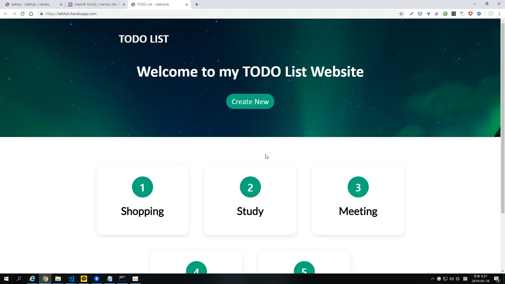
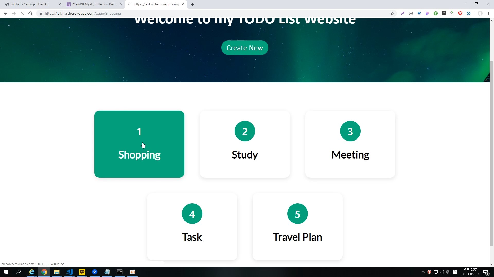
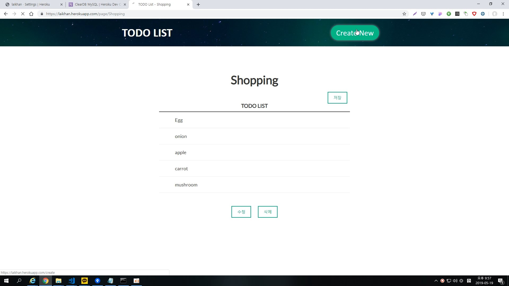
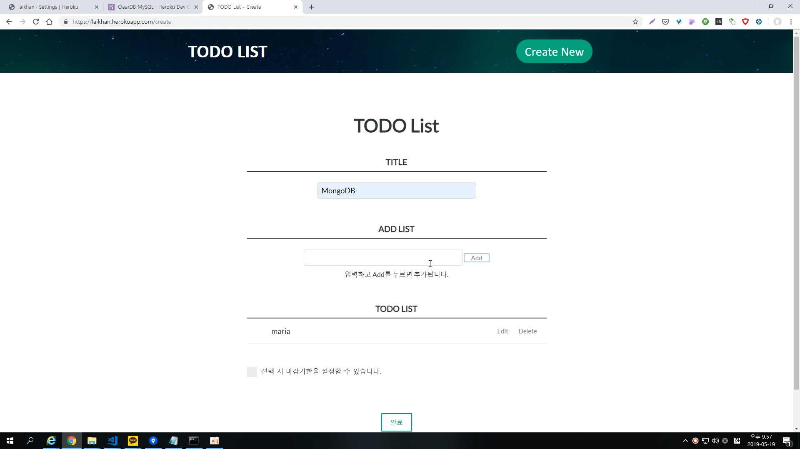
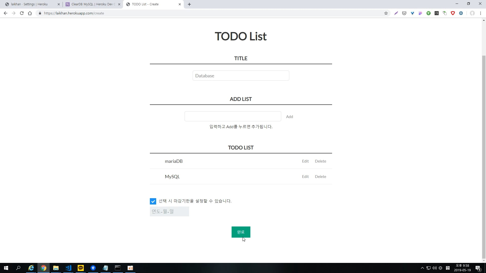
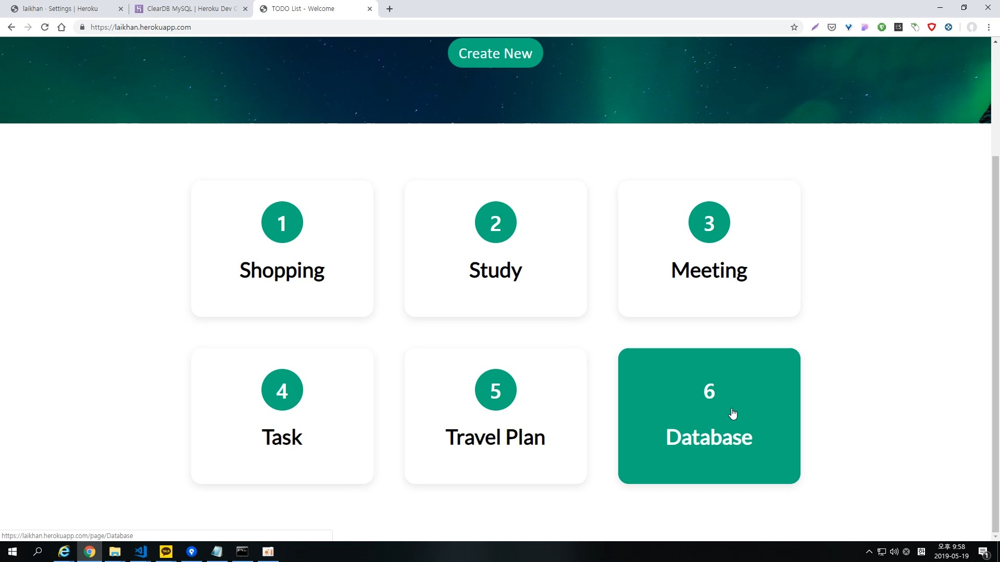
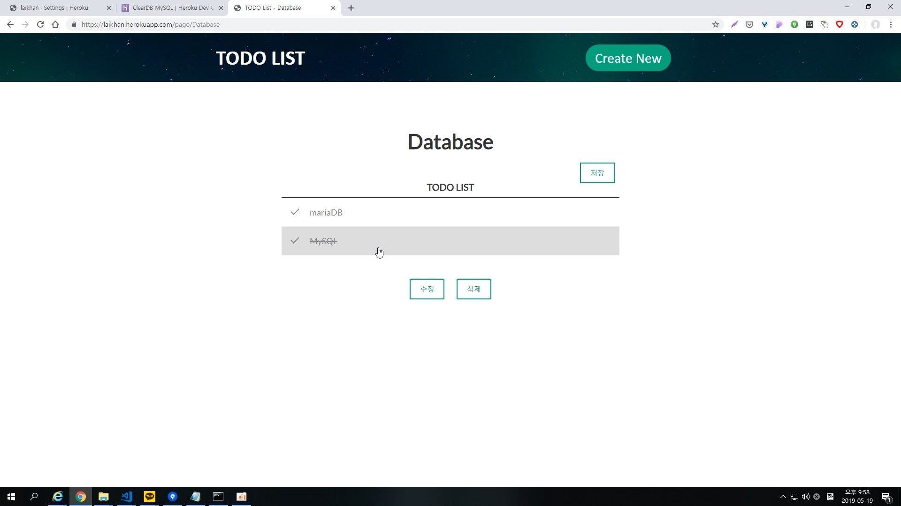

# TODO-list
### 프로그래머스 2019 Summer Coding 개발과제

---------------------------------------

## 과제

### 요구사항  
#### 기능 요구사항  
- 새로운 TODO(제목과 내용)를 작성할 수 있다.  
- TODO 목록을 볼 수 있다.  
- TODO 항목의 제목과 내용을 수정할 수 있다.  
- TODO 항목을 삭제할 수 있다.  
- 사용자의 선택에 의해 TODO에는 마감 기한을 넣을 수 있다.  
- TODO 항목의 우선순위를 설정 및 조절할 수 있다.  
- TODO 항목에 대한 완료 처리를 할 수 있다.  
- 마감기한이 지난 TODO에 대해 알림을 노출할 수 있다.  
#### 성능 요구사항  
- TODO 이용 시 발생하는 오류 사항을 최소화한다.  
- 오류 발생 시 사용자가 이해하기 쉽게 표시한다.  
- 다른 사람이 읽기 쉬운 코드를 작성한다.  
- HTML/CSS에서 사용할 수 있는 최신 구조와 기술을 사용한다.  
#### 인터페이스 요구사항  
- 직관적이고 의미 전달이 명확한 화면을 사용자에게 제공한다.  

-------------------------------------------------------

### 개발 성공한 기능  
- 새로운 TODO(제목과 내용)를 작성할 수 있다.  
- TODO 목록을 볼 수 있다.  
- TODO 항목의 제목과 내용을 수정할 수 있다.  
- TODO 항목을 삭제할 수 있다.  
- 사용자의 선택에 의해 TODO에는 마감 기한을 넣을 수 있다.  
- TODO 항목에 대한 완료 처리를 할 수 있다.  

----------------------------------------------------------

### 사용언어  
- 프론트엔드 : HTML, CSS, Javascript, jQuery  
- 백엔드 : Npde.js, Express.js, MySQL  

---------------------------------------------------------

### 접속해서 테스트 가능한 URL  
``` https://laikhan.herokuapp.com/ ```  

테스트 할 때는 잘 됐었으나 시간이 지나고 보니 에러로 잘 들어가지지 않았다.  
현재 ```Error: Connection lost: The server closed the connection.` 이란 에러로 접속 불가  
아직 해결방법 찾지 못했다   


</img>

--------------------------------------------------------

### 결과 이미지  

</img>   
</img>   
</img>   
</img>   
</img>   
</img>   
</img>   


### 구동 영상   

[](https://youtu.be/kTUHR43eCi4)      

--------------------------------------------------------

### 커밋 버전  
로컬에선 commit 'Modularization' 때 잘 돌아갔고  
Heroku는 commit 'Heroku3' 일 때 처음으로 웹 호스팅 성공, 하지만 금방 접속이 끊겼다.


### 설치 및 빌드 방법   


### 사용한 모듈들   
mysql    
express  
sanitize-html  
body-parser  
date-utils  
hubot-heroku-keepalive  
